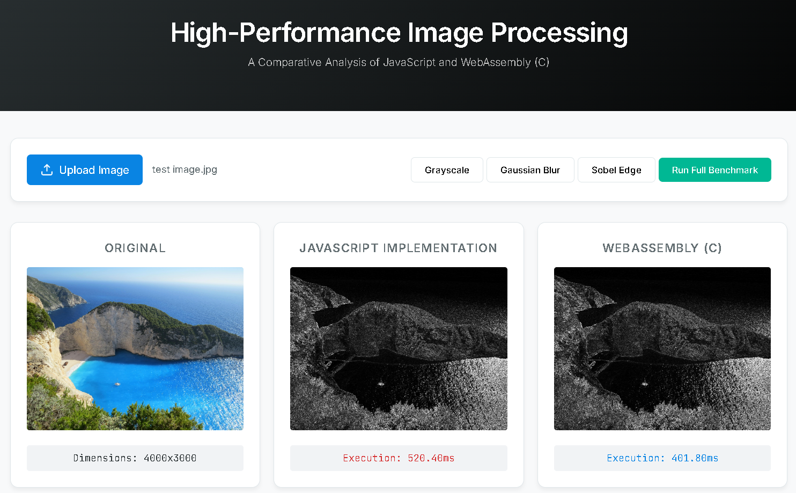

# High-Performance Image Processing with WebAssembly



A comparative analysis of CPU-intensive image processing filters implemented in both **Pure JavaScript** and **WebAssembly (C via Emscripten)**.

## 1. Introduction
This project demonstrates the performance advantages of WebAssembly (WASM) for compute-bound tasks in the browser. By offloading pixel-level convolution operations—which are traditionally slow in interpreted or JIT-compiled languages—to a binary format, we achieve near-native execution speeds.

## 2. Architecture Overview
The application follows a layered architecture to separate UI concerns from heavy lifting:

- **UI Layer (HTML5/CSS3)**: Minimalist design for image interaction and result visualization.
- **Control Layer (JavaScript)**: Orchestrates image uploads, manages WASM memory lifecycle, and handles benchmarking logic.
- **Computation Layer**: 
  - **JS Filters**: Baseline implementation using standard `ImageData` access.
  - **WASM Filters (C)**: High-performance implementation operating on linear memory pointers.

### Memory Architecture
The bridge between JavaScript and WebAssembly is handled via **Linear Memory**. 
1. **Allocation**: JS calls `_malloc_buffer` to reserve contiguous space on the WASM heap.
2. **Transfer**: The image's `Uint8ClampedArray` is copied into the heap via `Module.HEAPU8.set()`.
3. **Execution**: C functions operate directly on these pointers, avoiding the overhead of JS object indexing.
4. **Retrieval**: The processed buffer is read back into a JS TypedArray before rendering to Canvas.

## 3. Filters Implemented
- **Grayscale**: Simple luminosity weighted average (0.299R + 0.587G + 0.114B).
- **Gaussian Blur**: 3x3 convolution kernel for localized smoothing.
- **Sobel Edge Detection**: Gradient magnitude calculation using Gx and Gy kernels to identify high-contrast boundaries.

## 4. Performance Metrics (4000x3000 Resolution)
The following results were captured on a high-resolution sample to demonstrate execution speed. Each value represents the **average of 10 iterations** after JIT/WASM warmup.

| Filter | Resolution | JS Mean (ms) | WASM Mean (ms) | Speedup |
| :--- | :--- | :--- | :--- | :--- |
| **Grayscale** | 4000x3000 | 34.53 | 33.98 | **1.02x** |
| **Gaussian Blur** | 4000x3000 | 498.74 | 225.09 | **2.22x** |
| **Sobel Edge** | 4000x3000 | 744.55 | 406.99 | **1.83x** |

### Performance Analysis
- **Complexity Correlation**: Notice that for simple filters like **Grayscale**, the speedup is negligible (1.02x). This is because the performance gain in calculation is roughly equal to the overhead of copying $4000 \times 3000 \times 4$ bytes across the JS-WASM bridge.
- **Convolution Advantage**: For **Gaussian Blur** and **Sobel**, which involve nested loops and multiple memory lookups per pixel, WASM shows a significant advantage (~2x speedup), as the computational intensity outweighs the memory transfer costs.

## 5. Build Instructions
Requires [Emscripten SDK](https://emscripten.org/).

```bash
# Compile C filters to WASM
./build.sh
```

The build script uses `-O3` optimization to enable aggressive compiler optimizations, including loop unrolling and register allocation.

## 6. Performance Characteristics & Limitations
### Execution Estimates
WASM is expected to outperform JS by **2x to 5x** in convolution-heavy tasks (Blur/Sobel) due to predictable memory access and lack of garbage collection pauses.

### Limitations
- **Memory Bus Bottleneck**: Very large images may be capped by the speed of copying data between the JS heap and WASM memory.
- **JIT Maturity**: V8 is highly optimized; for extremely simple loops (Grayscale), the difference may be less pronounced.

## 7. Future Work
- **SIMD (`-msimd128`)**: Utilizing 128-bit hardware registers to process multiple pixels in a single instruction.
- **Multi-threading**: Implementing Web Workers with SharedArrayBuffer to parallelize convolution across CPU cores.
